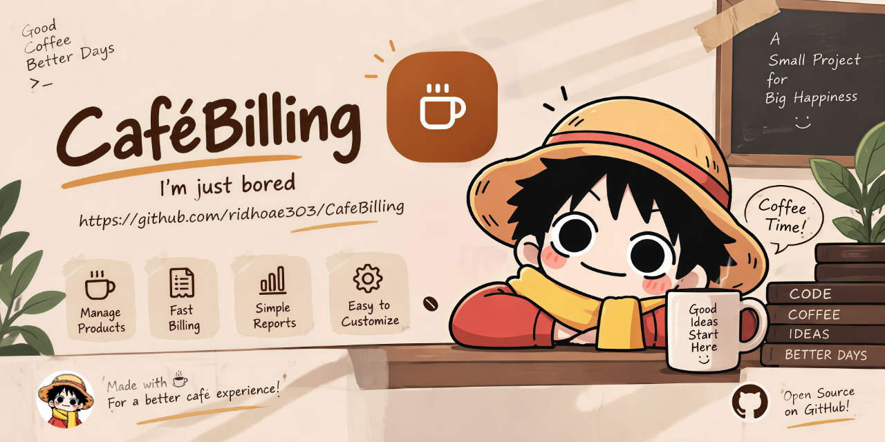

<p align="center">
  
</p>

# CaféBilling


[](https://github.com/ridhoae303/CafeBilling)
[](LICENSE)
[](#data-and-storage)
[](https://ridhoae303.github.io/CafeBilling/)

A small cafe / minimarket POS I built for fun. It is a static browser-side application built only with HTML, CSS, and JavaScript.

This project is 100% simulated. There is no database, no real payment processing, and no production backend. Product data, cart state, and transaction history stay in the browser through `localStorage`.

## What's inside

- Product and stock management
- Add, edit, delete, search, and filter products
- Cart-based checkout
- Automatic tax and change calculation
- Payment receipt preview, print, and download
- Transaction history and reprint support
- Responsive desktop, tablet, and mobile layouts
- Mobile hamburger navigation
- Smooth UI animations and micro-interactions
- GitHub contributor panel powered directly by the GitHub REST API
- Local SVG product artwork
- Developer profile page with avatar fallback
- Global image preview viewer for local and linked images
- Custom GitHub Pages 404 page

## Stack

```text
HTML
CSS
JavaScript
Lucide Icons
localStorage
GitHub REST API
```

No framework. No build step. No npm setup. Just HTML, CSS, JavaScript, and browser storage.

## Run locally

Because CafeBilling is fully static, it can be opened directly from `index.html` or served by any simple static file server.

For the cleanest browser test, serve the folder with a static server such as VS Code Live Server, or any equivalent static HTTP server.

## Admin route

The customer page is the normal `index.html` entry point. The cashier / admin area has its own static route:

```text
/admin/
```

On GitHub Pages this resolves to the `admin/index.html` entry point. The same JavaScript application loads there, shows the Admin Login Dialog first, and then unlocks the complete cashier interface after local demo authentication.

## GitHub Pages

Repository:

https://github.com/ridhoae303/CafeBilling

Expected Pages URL:

https://ridhoae303.github.io/CafeBilling/

## Data and storage

This project is simulation-only.

There is no database and no persistent server-side storage. Product data, cart contents, and transaction history live in the browser through `localStorage`. Clearing the site data resets the project back to its initial state.

Nothing here is meant to be production-ready. It is just a small POS playground built for fun.

Images opened from the UI use the built-in preview viewer instead of forcing a direct download. Linked image files are intercepted and previewed in the same viewer.

## Project structure

```text
CafeBilling/
├── assets/
│   ├── developer.jpg
│   └── images/
├── banner/
│   └── cafe-banner.png
├── css/
│   └── style.css
├── js/
│   └── app.js
├── 404.html
├── .gitignore
├── index.html
├── admin/
│   └── index.html
├── LICENSE
├── CONTRIBUTORS.md
└── README.md
```

## Developer

**ridhoae303**

GitHub:

https://github.com/ridhoae303

The Developer page tries to load the local avatar first:

```text
assets/developer.jpg
```

If the local image is missing or fails to load, the UI falls back to the GitHub profile avatar:

```text
https://github.com/ridhoae303.png
```

## Contributors

Contributor cards are generated directly from the GitHub Contributors API:

```text
https://api.github.com/repos/ridhoae303/CafeBilling/contributors
```

New contributors are picked up automatically and rendered as new cards. There is no need to manually edit the frontend for each contributor.

The repository needs to be public and reachable from the browser for the contributor panel to populate normally.

## License

CafeBilling Custom License. See [`LICENSE`](LICENSE).

---

Made with JavaScript and probably too much UI tweaking.

## Role & Transaction Flow

CafeBilling separates the public/customer display from the operational cashier area.

- **User / Pelanggan** opens directly into the Menu Produk. Customer navigation is intentionally hidden; the customer can browse products, manage the customer cart, checkout to the cashier, and use the five-minute History Checkout editing window.
- **Admin / Kasir** controls the operational flow: product and stock management, cart creation, quantity changes, payment nominal, change calculation, transaction saving, transaction history, and receipt printing/download.
- Cart data is still stored locally because the project is a simulation, but all cart mutation functions and transaction actions are guarded by the admin session.
- Destructive actions such as deleting products, clearing the cashier cart, and resetting demo data use an in-app confirmation dialog instead of the browser's native `confirm()` dialog.
- The demo login configuration is bundled locally in `data/admin-config.js` (with `data/admin.json` retained as a human-readable reference).
- The repository stores the demo admin password as a SHA-256 hash rather than plaintext.
- Because this is a static frontend without a backend, the admin session is a demonstration access-control gate, not server-grade authentication. Do not use real credentials or sensitive data in production.

## Payment Receipt Flow

After the Admin / Kasir completes a payment, CafeBilling opens an in-app receipt preview. Printing and downloading the receipt are available from that admin-only flow; customers do not receive receipt controls in the public UI.
